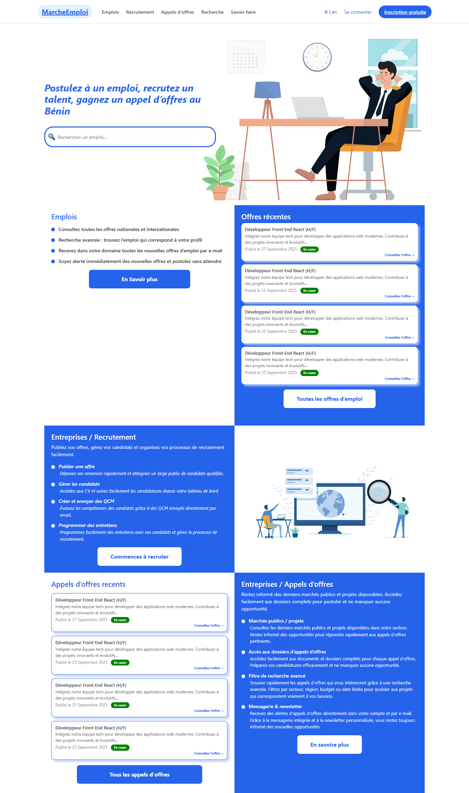
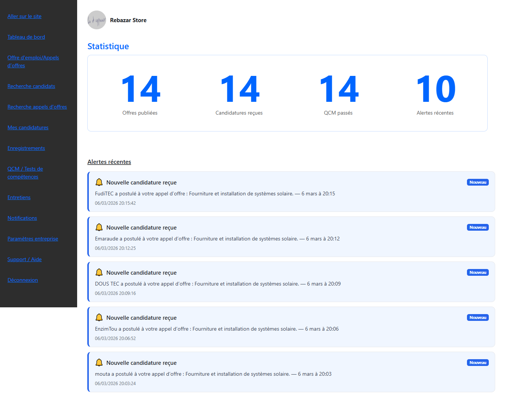
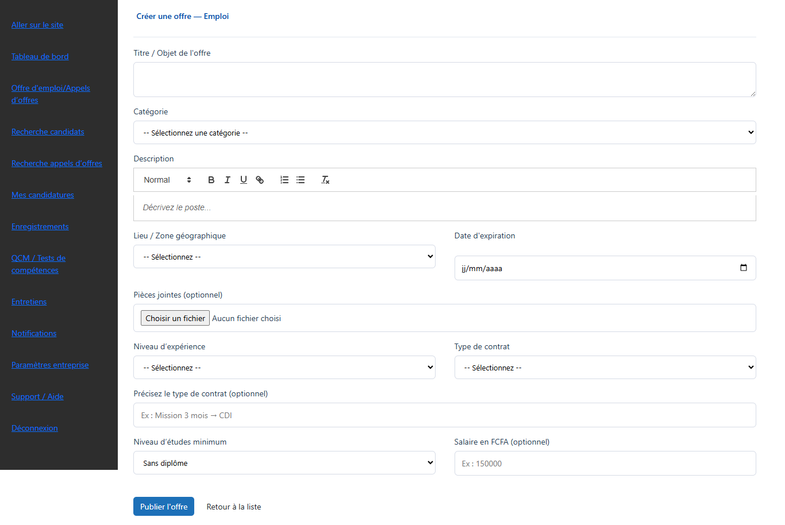
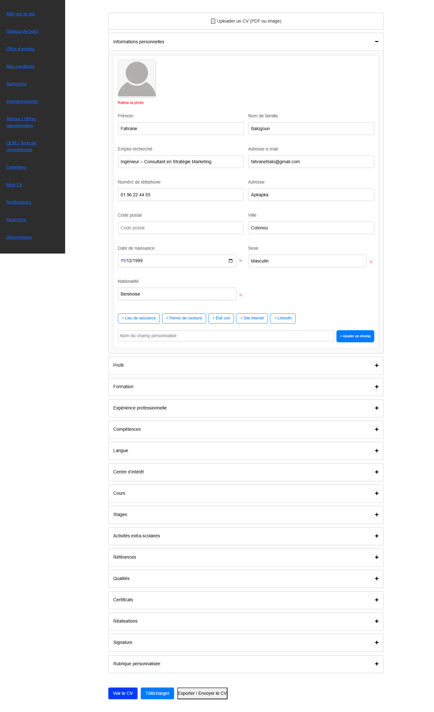

# MarcheEmploi

MarcheEmploi is a job platform primarily designed for West African countries.  
It allows companies to recruit candidates and enables job seekers to apply for job opportunities.

The platform integrates Artificial Intelligence to analyze candidate CVs and extract useful information to assist the recruitment process.

MarcheEmploi est une plateforme d’emploi principalement destinée aux pays d’Afrique de l’Ouest.  
Elle permet aux entreprises de recruter des candidats et aux chercheurs d’emploi de postuler aux offres.

La plateforme intègre de l’intelligence artificielle pour analyser les CV des candidats et extraire des informations utiles au processus de recrutement.

Ce projet est actuellement en cours de developpement et constitue une partie du programme de développement de la plateforme.

## Features

- Company dashboard for recruitment management
- Candidate dashboard for managing job applications
- Integrated multiple-choice tests (QCM) for recruitment
- Job offer publication for companies
- Creation of recruitment tests and interview scheduling by companies
- CV database (CV library)
- CV upload and processing
- AI-based CV analysis
- Extraction of skills and relevant information from resumes

## Future AI Features

- Integration of AI with the database to improve CV search in the CV library.
- AI-based candidate and job matching system.
- Intelligent search for candidates based on skills and experience.

## Technologies Used

- Next.js (Frontend)
- Node.js / Express (Backend API)
- Python (AI processing)
- OpenAI API for CV analysis
- Sequelize (Database ORM)

## Project Structure

marcheemploi/
│
├── frontend/      # Next.js application
├── backend/       # Node.js / Express API
├── ai/            # Python scripts for CV analysis
└── README.md

## Screenshots

### Home

### Company Dashboard

### Create Job Call

### CV Analysis

